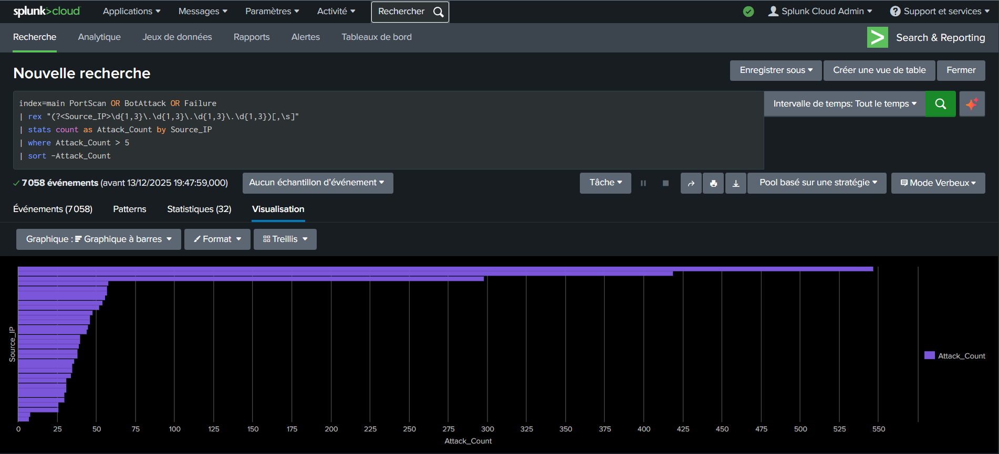
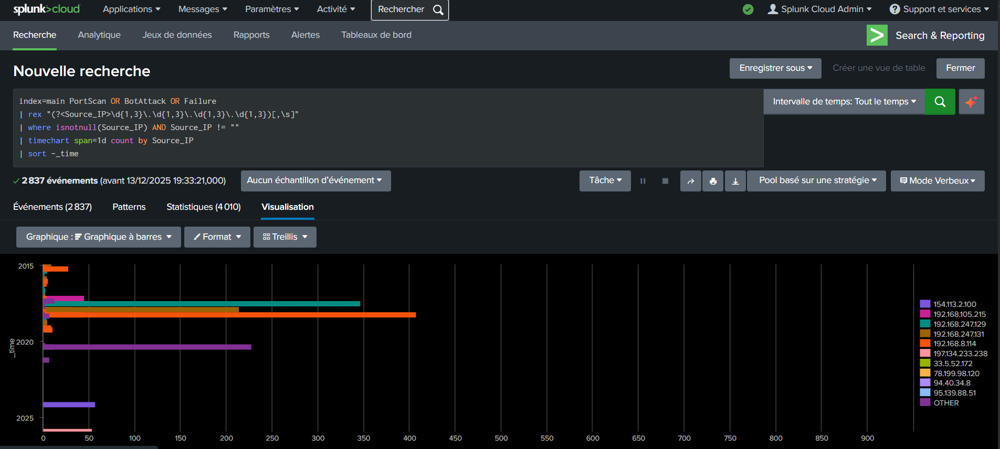
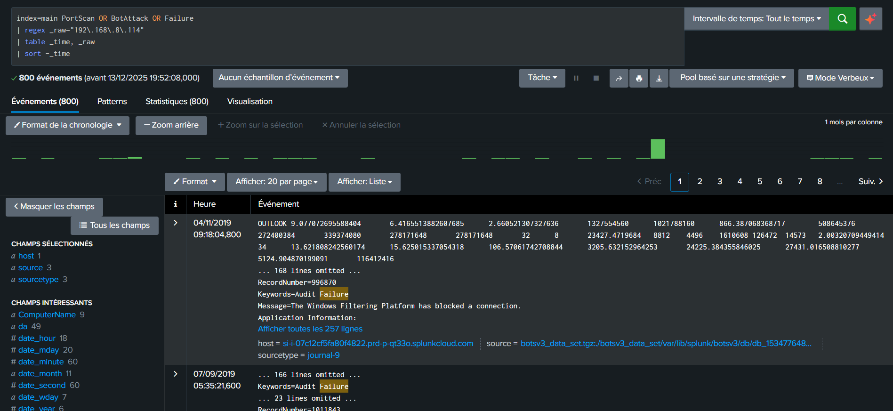
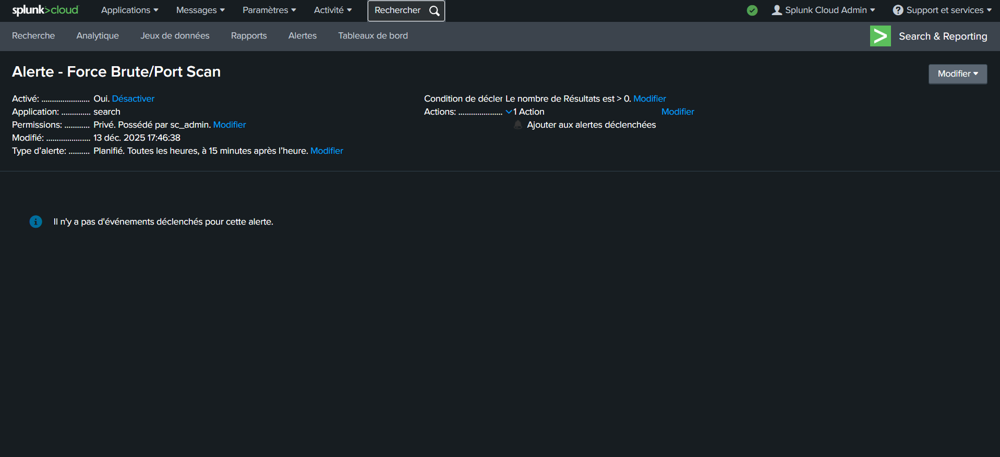

# Security Evidence Guide

This folder contains critical screenshots that serve as proof for the analysis and the implementation of the Splunk detection rule.

## 1. Total Count Visualization
* **Description:** Shows the result of the `| stats count by Source_IP` query, visualized as a bar chart.
* **Key Finding:** Confirms the main attacker, `192.168.8.114`, is responsible for the largest count of events (547), justifying the focus on this IP.
 
  

## 2. Time Triage Visualization
* **Description:** Shows the time-series chart (`| timechart span=1d`) after filtering out noise (`| where isnotnull...`).
* **Key Finding:** This chart was essential for the initial triage, clearly showing the concentrated attack periods in 2018 and 2019, which led to the discovery of the August 20, 2018, peak.
  

## 3. Raw Event Triage
* **Description:** Shows the raw event logs (`| table _time, _raw`) after filtering for the attacker IP (`| regex _raw="192\\.168\\.8\\.114"`).
* **Key Finding:** This confirms the exact time window of the attack (peaking in 2018, with activity seen as late as November 4, 2019) and validates that the events are genuine `Audit Failure` logs related to the brute-force attempt.

  

## 4. Implementation Proof
* **Description:** Screenshot of the Splunk Alert creation interface.
* **Key Finding:** Proves the successful industrialization of the detection logic into an automated, scheduled alert (`Type: Scheduled`) that triggers when the attack count exceeds the threshold (e.g., `Count > 0` for the query which already filters on `Attack_Count > 5`).

